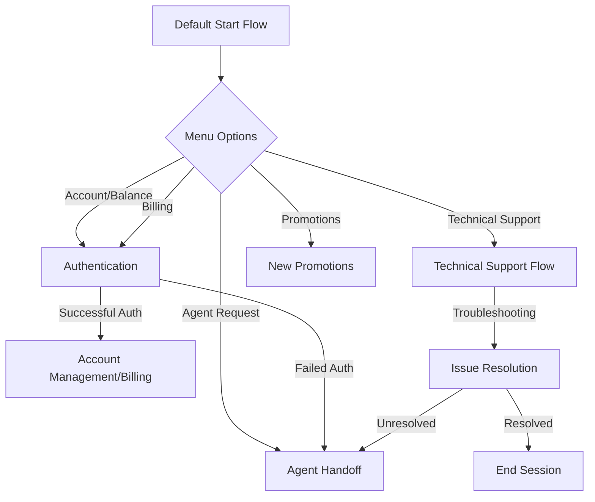
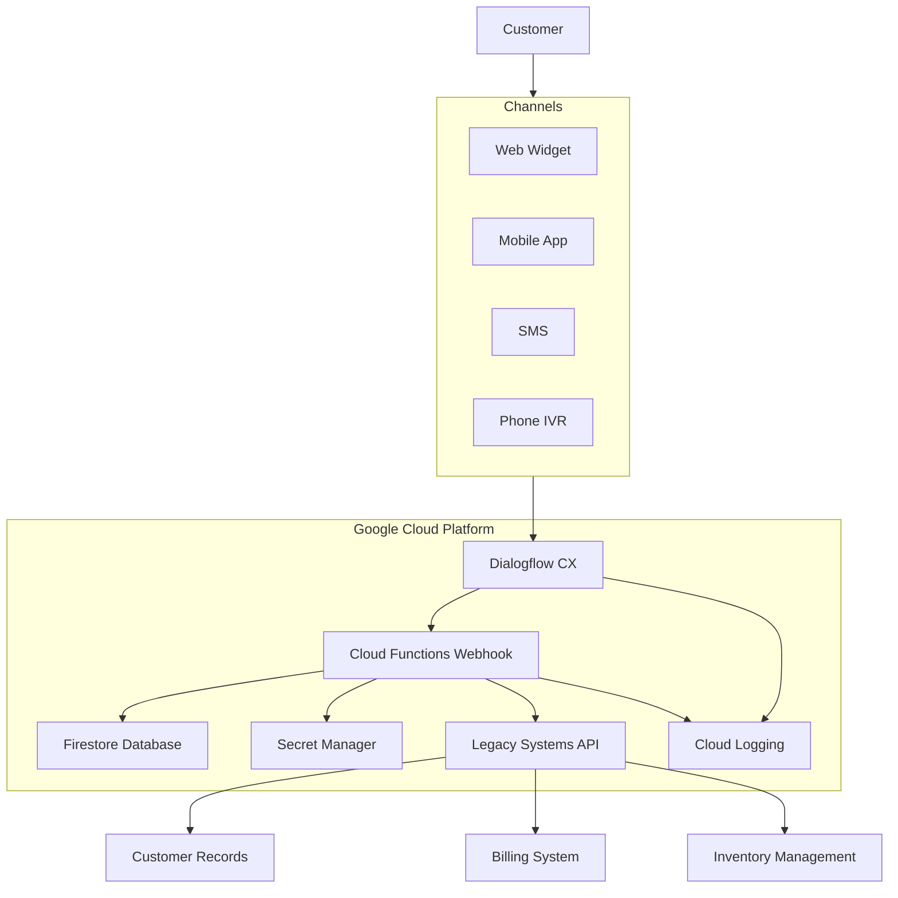
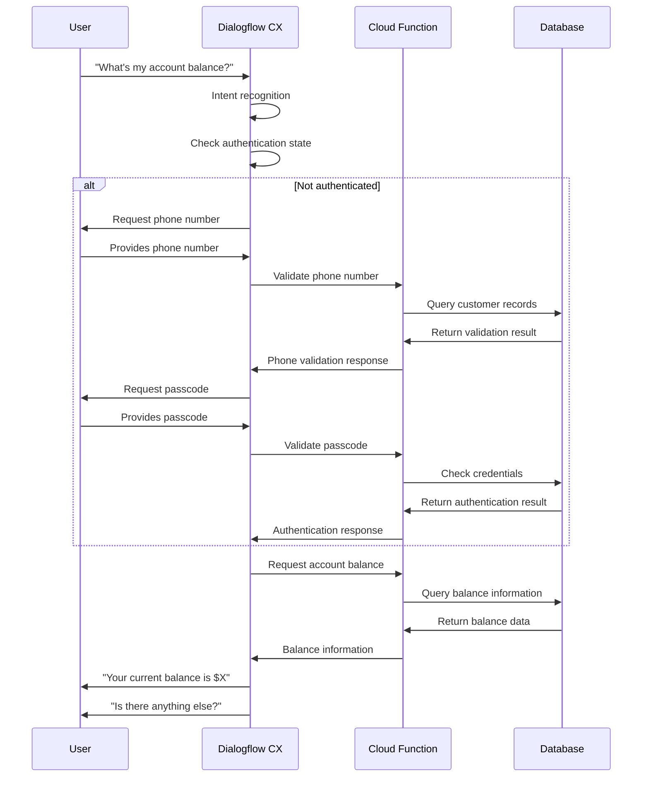

# 📱 Telecom Virtual Agent

  

*An intelligent virtual assistant for telecommunications customer service built on Google's Conversational AI platform*

## 🌟 Overview

This virtual assistant is designed to provide seamless telecommunications customer service, handling a wide range of inquiries automatically before connecting customers to human agents when necessary. Built on Google's robust Conversational AI platform, it delivers personalized, efficient support around the clock.

## ✨ Key Features

### Core Capabilities

| Feature | Description |
|:-------:|:------------|
| 💼 **Account Management** | Access balance information and manage account profile details |
| 🔐 **Authentication** | Secure verification through phone number and passcode |
| 💳 **Billing Support** | Explanation of charges and convenient payment processing |
| 🛠️ **Technical Assistance** | Step-by-step troubleshooting for common service issues |
| 👥 **Agent Handoff** | Smooth transition to human agents for complex inquiries |

### Technical Support Categories

The assistant provides automated troubleshooting for frequent technical issues:

- 📶 No signal/poor network connectivity
- 🚀 Slow data connections
- 📞 Dropped calls

### Conversation Flows

## 🏗️ Technical Architecture

The virtual agent is built with these components:

- **Entity Types**: Structured data recognition (phone numbers, dates, names)
- **Intents**: Machine learning models trained to understand user requests
- **Flows**: Orchestrated conversation paths for different scenarios
- **Pages**: Individual interaction steps within each flow
- **Webhooks**: API integrations for secure verification and data retrieval

## ⚙️ Setup & Deployment

### Prerequisites

- Google Cloud Platform account with Dialogflow CX / CCAI enabled
- Access to webhook endpoints (configured at `tia-func-907971469140.us-central1.run.app`)

### Configuration

The agent includes pre-configured settings:

- 🌐 Default language: English
- 🗣️ Speech adaptation for improved recognition
- 🔢 DTMF (touch-tone) support for phone interactions
- 📊 Comprehensive logging for conversation analytics

## 👤 User Experience

The virtual agent provides a context-aware conversational interface with time-based greetings:

> "Good [morning/afternoon/evening]! Hello! I'm Mobile's virtual assistant. What can I assist you with today?"

## 🚀 Extended Capabilities

- **Multi-channel Support**: Optimized for voice, chat, and messaging platforms
- **Authentication Security**: Three-attempt limit with automatic agent handoff
- **Integration Ready**: Flexible webhook system for seamless backend connectivity

## 🔧 Development & Architecture

The agent architecture allows for easy expansion of:

- ✅ New intents and training phrases
- ✅ Additional flows for new service offerings
- ✅ Enhanced entity recognition capabilities

## 🔄 Interaction Flow

## 🔮 Future Enhancements

- 💰 Additional payment methods and billing options
- 🛠️ Expanded technical troubleshooting capabilities
- 🎯 Personalized recommendations based on customer profiles
- 🌐 Multilingual support for diverse customer base

---

*This virtual agent provides 24/7 customer support for telecommunications services while maintaining robust security standards and ensuring seamless handoff to human agents when required.*

[Report an Issue](https://github.com/Wiikay/CCAI/issues) • [Request a Feature](https://github.com/Wiikay/CCAI/issues)

