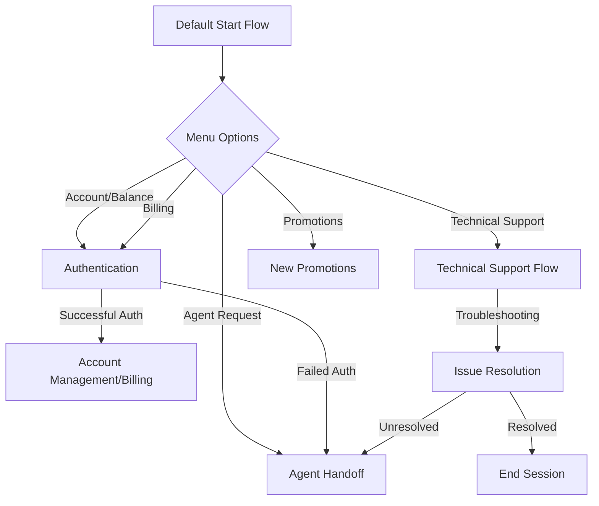
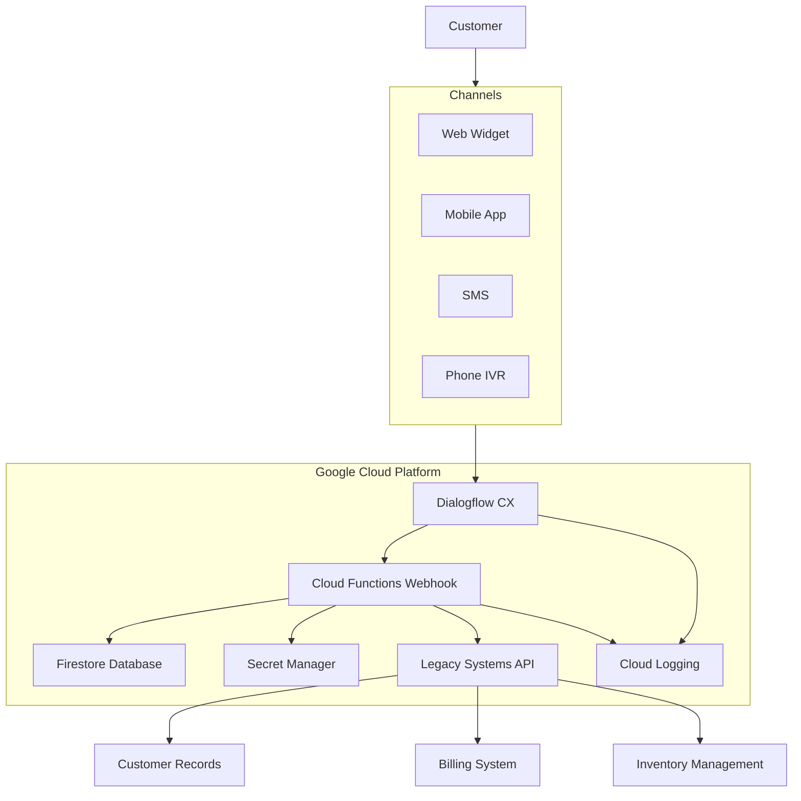
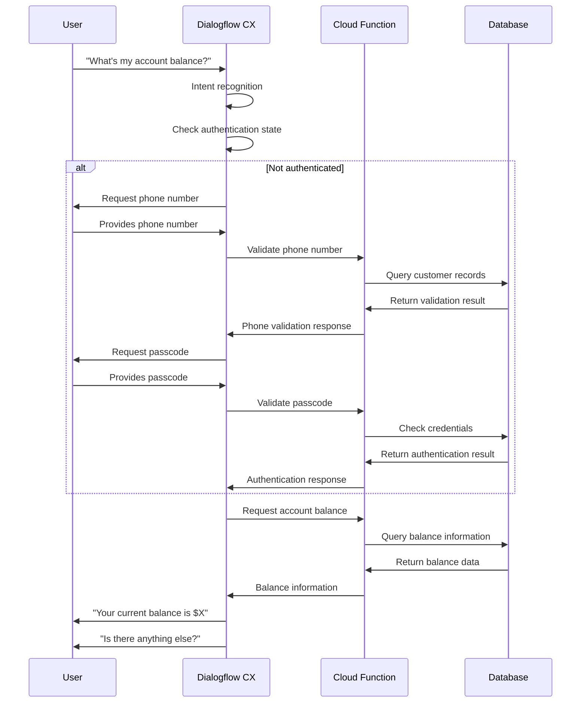

# Telecom Virtual Agent 📱

## Overview

This repository contains a virtual assistant designed for telecommunications customer service, built using Google's Conversational AI platform. The virtual agent can handle a variety of customer inquiries including account management, billing questions, technical support, and more, providing an automated first line of support before connecting customers to human agents when necessary.

## Features

### Core Capabilities

| Feature | Description |
|---------|-------------|
| Account Management | Balance inquiries and account profile information |
| Authentication | Secure verification via phone number and passcode |
| Billing Support | Bill explanations and payment processing |
| Technical Assistance | Troubleshooting for network issues and service problems |
| Agent Handoff | Seamless transfer to human agents when needed |

### Technical Support Categories

The virtual agent provides troubleshooting for common technical issues:

- No signal/poor network connectivity
- Slow data connections
- Dropped calls

### Conversation Flows

## Technical Architecture

The virtual agent is built with the following components:

- **Entity Types**: Structured data types for recognizing and processing user inputs (phone numbers, dates, names, etc.)
- **Intents**: Trained conversation models for understanding user requests
- **Flows**: Orchestrated conversation paths for handling different scenarios
- **Pages**: Individual interaction steps within each flow
- **Webhooks**: API integrations for verification and data retrieval

## Setup & Deployment

### Prerequisites

- Google Cloud Platform account with Dialogflow CX / CCAI enabled
- Access to webhook endpoints (currently configured at `tia-func-907971469140.us-central1.run.app`)

### Configuration

The agent comes with pre-configured settings:

- Default language: English
- Speech adaptation enabled for improved recognition
- DTMF (touch-tone) support for phone interactions
- Logging enabled for conversation analytics

## User Experience

The virtual agent provides a conversational interface with context-aware greetings based on time of day:

- "Good morning! Hello! I'm Mobile's virtual assistant. What can I assist you with today?"
- "Good afternoon! Hello! I'm Mobile's virtual assistant. What can I assist you with today?"
- "Good evening! Hello! I'm Mobile's virtual assistant. What can I assist you with today?"

## Extended Capabilities

- **Multi-channel Support**: Ready for voice, chat, and messaging platforms
- **Authentication Security**: Three-attempt limit before agent handoff
- **Integration Ready**: Webhook system for backend connectivity

## Development & Customization

The agent structure allows for easy expansion of:

- New intents and training phrases
- Additional flows for new service offerings
- Enhanced entity recognition

## Future Enhancements

- Additional payment methods
- Expanded technical troubleshooting capabilities
- Personalized recommendations based on customer profile

---

*This virtual agent is configured to provide 24/7 customer support for telecommunications services while maintaining security standards and providing a seamless handoff to human agents when required.*

